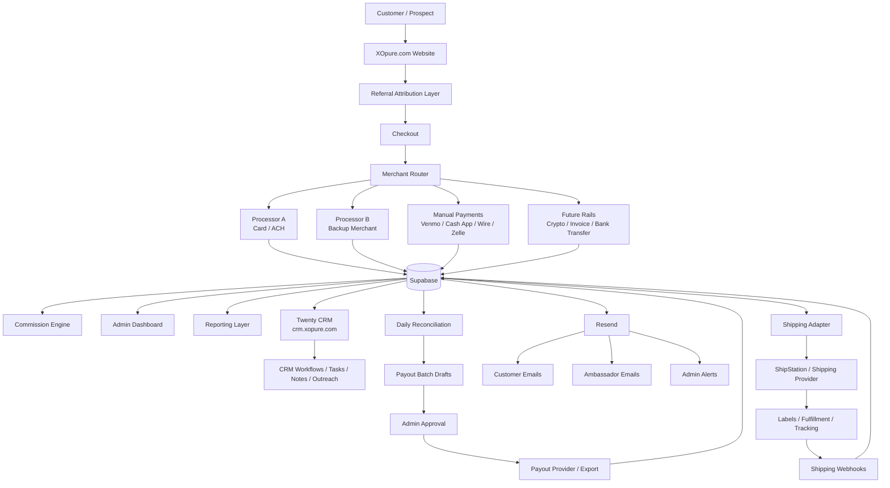
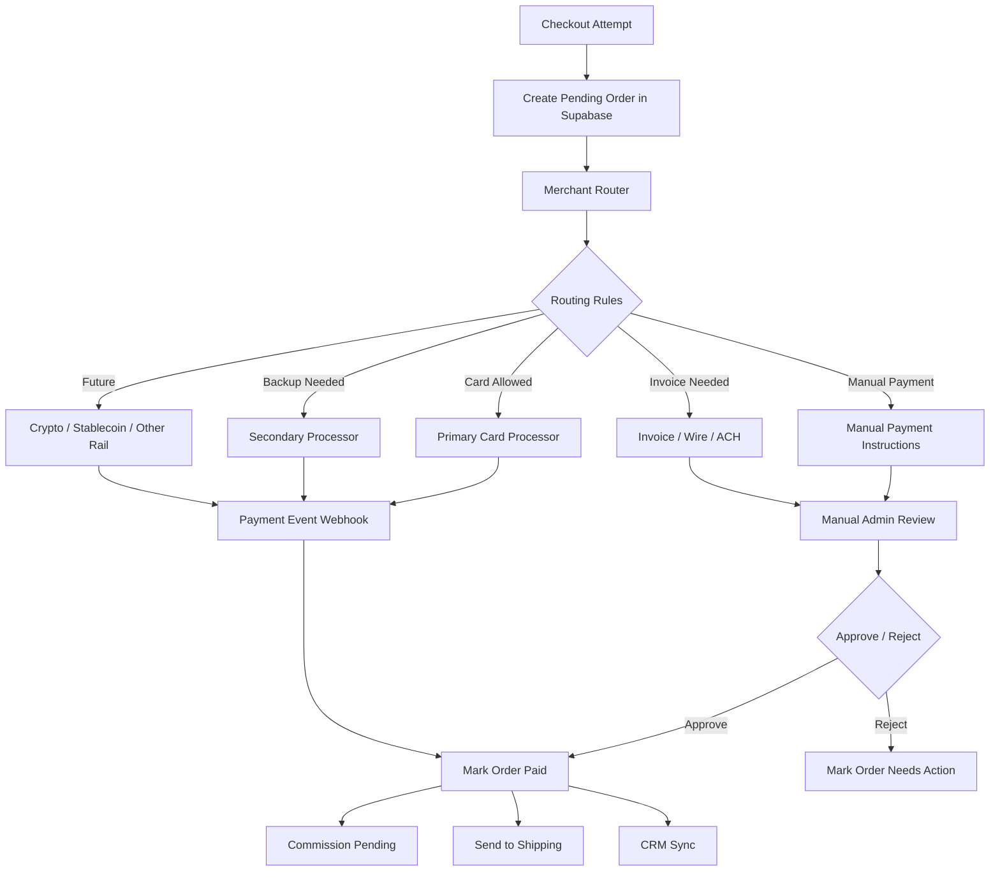
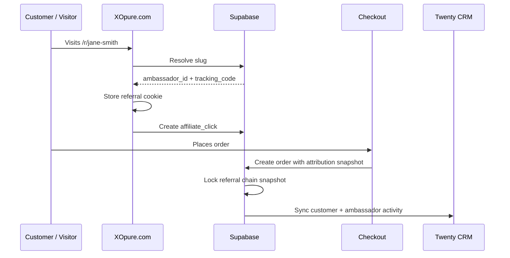
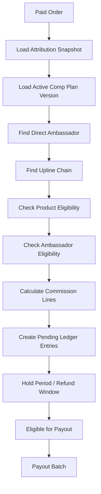
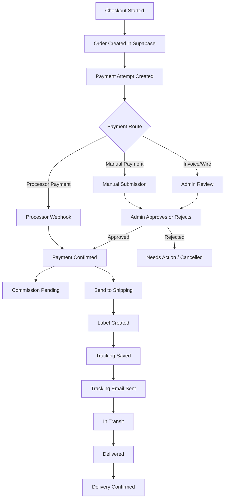
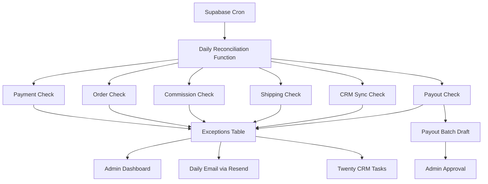
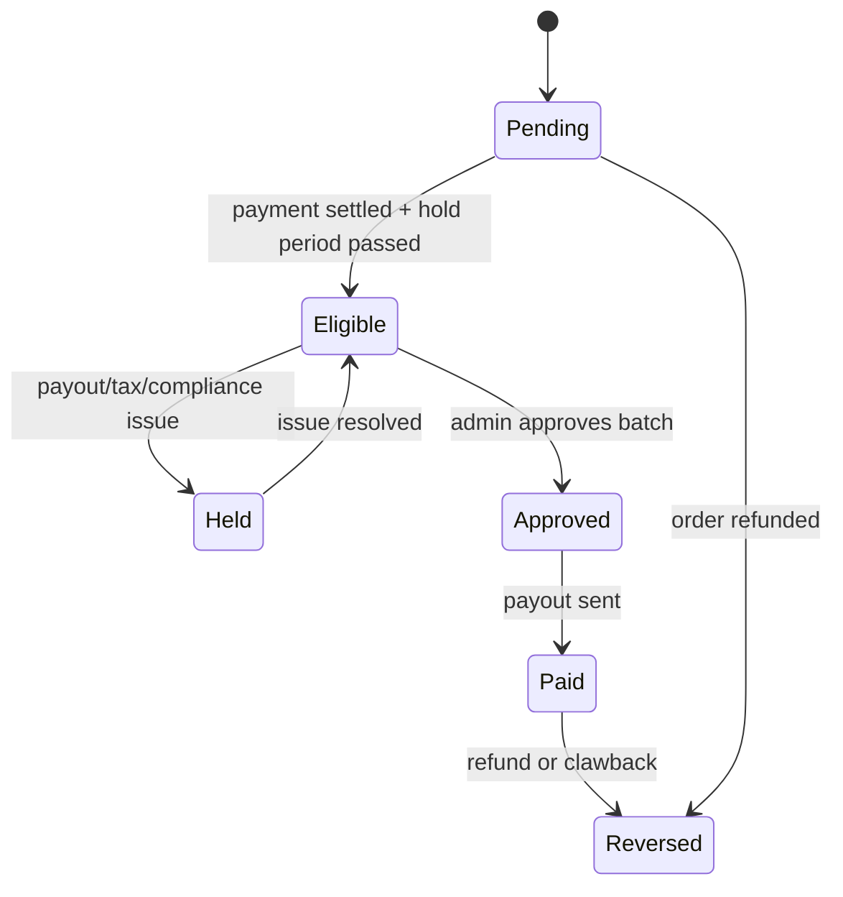
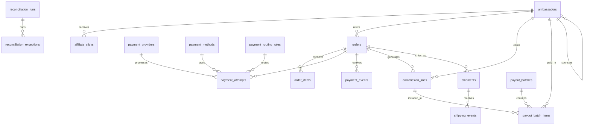

Absolutely — correction locked in:

**Brand/domain: XOpure.com**
Not XL Pure. Not ExoPure. The correct public brand spelling is **XO Pure / XOpure.com**: the letter **X**, the letter **O**, then **Pure**.

Below is the more final version, now including the **merchant-processing abstraction layer**, so XO Pure can support multiple processors, manual payments, backup rails, crypto/ACH/card options, and future routing without rebuilding the whole system.

---

# XO Pure Ambassador + CRM + Merchant + Fulfillment System

## 1. Core architecture principle

XO Pure should be designed around one clean rule:

> **Supabase is the system of record. Twenty CRM is the relationship/workflow layer. Merchant processors, shipping tools, and email systems are replaceable service providers connected through adapters.**

That means the business should not be hardwired to a single merchant processor, shipping vendor, CRM view, or payout rail.

The architecture should support:

| Layer                               | Primary role                                                                                 |
| ----------------------------------- | -------------------------------------------------------------------------------------------- |
| **XOpure.com**                      | Public storefront, ambassador links, checkout, customer capture                              |
| **Supabase**                        | Source of truth for users, orders, referrals, commissions, shipping, payouts, reconciliation |
| **Twenty CRM at `crm.xopure.com`**  | Ambassador management, customer relationships, workflows, tasks, pipeline visibility         |
| **Merchant Router**                 | Routes payment attempts across multiple processors/manual rails                              |
| **ShipStation / shipping platform** | Fulfillment, labels, tracking, shipping events                                               |
| **Resend**                          | Transactional email system                                                                   |
| **Admin Dashboard**                 | Payment review, payout approval, reconciliation, reporting                                   |
| **Daily reconciliation jobs**       | Catches mismatches between payments, orders, shipping, commissions, CRM, and payouts         |

Supabase Edge Functions are a strong fit for webhooks and third-party integrations, while Supabase Cron can schedule recurring reconciliation jobs and invoke Edge Functions on a schedule. ([Supabase][1])

---

# 2. Final system map



ShipStation supports webhook-style updates where shipment/order events can be pushed to your server, which is the correct pattern for keeping Supabase updated without constantly polling shipping status. ([ShipStation Docs][2])

Twenty CRM can be extended with custom objects and workspace-specific APIs, which makes it useful for custom XO Pure objects like ambassadors, orders, shipments, payouts, commission records, and onboarding pipelines. ([Twenty Documentation][3])

---

# 3. The most important addition: merchant-processing router

Because XO Pure may need multiple merchant options at any given time, payment handling should be built as a **merchant router**, not as a single hardcoded payment integration.

## Why this matters

Health, wellness, peptide-adjacent, supplement, and alternative payment categories often need flexibility. Even if one processor works today, you want the system to survive:

| Risk                          | Why the router matters                               |
| ----------------------------- | ---------------------------------------------------- |
| Processor account freeze      | Route new orders to backup provider                  |
| Product-specific restrictions | Send different SKUs through different processors     |
| High-risk review              | Keep manual invoice/payment option available         |
| Chargeback pressure           | Temporarily route certain orders differently         |
| Failed card processor         | Switch checkout rail without breaking order logic    |
| New payment method            | Add it as an adapter, not a rewrite                  |
| Manual payment approvals      | Venmo/Cash App/wire can still feed same order ledger |

---

# 4. Merchant router model



---

# 5. Merchant-router design

## Required payment tables

| Table                          | Purpose                                                   |
| ------------------------------ | --------------------------------------------------------- |
| `payment_providers`            | List of processors/rails available                        |
| `payment_methods`              | Card, ACH, manual, Venmo, Cash App, wire, crypto, invoice |
| `payment_routing_rules`        | Which provider/method to use under which conditions       |
| `payment_attempts`             | Every attempted payment                                   |
| `payment_events`               | Webhook events from processors                            |
| `manual_payment_submissions`   | Screenshot/reference uploads for Venmo/Cash App/wire      |
| `payment_reviews`              | Admin approval/rejection of manual payments               |
| `payment_reconciliation_items` | Daily mismatches and exceptions                           |

---

## Example `payment_providers`

| Provider                 | Type     | Status   | Notes                       |
| ------------------------ | -------- | -------- | --------------------------- |
| `primary_card_processor` | card/ACH | active   | Default online processor    |
| `backup_card_processor`  | card     | standby  | Emergency backup            |
| `manual_venmo`           | manual   | active   | Requires admin approval     |
| `manual_cashapp`         | manual   | active   | Requires admin approval     |
| `manual_wire`            | manual   | active   | Larger orders               |
| `crypto_stablecoin`      | future   | disabled | Future optional rail        |
| `invoice_pay`            | invoice  | active   | B2B/large ambassador orders |

---

## Example routing rules

| Rule                          | Processor behavior                    |
| ----------------------------- | ------------------------------------- |
| Normal customer card checkout | Use primary processor                 |
| Primary processor unavailable | Route to backup processor             |
| Large wholesale order         | Offer invoice/wire                    |
| Ambassador starter pack       | Allow card + manual                   |
| Product category flagged      | Hide unsupported processors           |
| Manual payment selected       | Create pending order and instructions |
| Failed payment attempt        | Allow fallback option                 |
| Admin override                | Force specific payment route          |

---

# 6. Source-of-truth rule for merchant processing

The processor should never be the source of truth.

The order flow should be:

```txt
Checkout creates order in Supabase
        ↓
Merchant router creates payment attempt
        ↓
Processor/manual method receives payment request
        ↓
Payment event or admin review updates Supabase
        ↓
Supabase updates order status
        ↓
Commission, shipping, CRM, and email flows trigger from Supabase
```

This protects XO Pure from processor changes. If you switch processors, the internal order, commission, shipping, and payout logic stays intact.

---

# 7. XO Pure ambassador/referral architecture

## Core model

Every ambassador needs:

| Field                  | Purpose                                |
| ---------------------- | -------------------------------------- |
| `id`                   | Internal UUID                          |
| `user_id`              | Login/auth user if applicable          |
| `email`                | Main contact                           |
| `phone`                | SMS/voice/contact workflows            |
| `display_name`         | Public-facing name                     |
| `status`               | pending, active, suspended, terminated |
| `tracking_code`        | Stable referral code                   |
| `slug`                 | Pretty referral URL                    |
| `parent_ambassador_id` | Sponsor/upline                         |
| `rank`                 | Ambassador rank/status                 |
| `level_unlock_status`  | Which levels they can earn from        |
| `payout_status`        | missing, pending, verified, held       |
| `tax_status`           | not_started, pending, verified         |
| `created_at`           | Signup date                            |
| `activated_at`         | Activation date                        |
| `last_sale_at`         | Latest referred sale                   |

---

## Referral URLs

XO Pure should support both:

```txt
https://xopure.com/r/{slug}
https://xopure.com/?ref={tracking_code}
```

Example:

```txt
https://xopure.com/r/jane-smith
https://xopure.com/?ref=JANE42
```

Use:

| Public identifier | Internal purpose               |
| ----------------- | ------------------------------ |
| `slug`            | Pretty, human-readable URL     |
| `tracking_code`   | Stable public referral code    |
| `ambassador_id`   | True internal identity         |
| `slug_history`    | Keeps old referral links alive |

The stable commission identity should always be the internal `ambassador_id`, not just the slug.

---

# 8. Attribution flow



The critical part is the **chain snapshot**.

At the time of order, save:

| Snapshot item                  | Why it matters                 |
| ------------------------------ | ------------------------------ |
| Direct referrer                | Who made the sale              |
| Upline chain                   | Who may earn L2/L3 commissions |
| Active comp plan version       | Which rules apply              |
| Product commission eligibility | Which products count           |
| Customer/order values          | Basis for commission           |
| Timestamp                      | Prevents later disputes        |

This way, if someone changes sponsors later, the old order still pays according to the structure that existed when the sale happened.

---

# 9. Ambassador levels and comp-plan logic

The system should support your current structure while remaining configurable.

## Example level structure

| Level | Recipient                   | Purpose                        |
| ----- | --------------------------- | ------------------------------ |
| L1    | Direct referring ambassador | Primary direct sale commission |
| L2    | First upline                | Sponsor override               |
| L3    | Second upline               | Deeper team override           |

## Example unlock logic

| Condition                 | Result                                    |
| ------------------------- | ----------------------------------------- |
| 1 personal signup         | Ambassador can earn L1 only               |
| 2+ personal signups       | Ambassador can unlock L1–L3 participation |
| Missing payout info       | Commission accrues but payout is held     |
| Suspended ambassador      | New commissions held or blocked           |
| Refunded order            | Commission reversed or clawed back        |
| Manual payment unapproved | No commission created yet                 |

The exact rates should live in `comp_plan_versions`, not hardcoded in frontend or CRM.

---

# 10. Commission engine



## Commission line fields

| Field                     | Purpose                                              |
| ------------------------- | ---------------------------------------------------- |
| `commission_line_id`      | Unique ledger record                                 |
| `order_id`                | Source order                                         |
| `ambassador_id`           | Who earned it                                        |
| `source_ambassador_id`    | Direct referring ambassador                          |
| `level`                   | L1, L2, L3                                           |
| `basis_amount_cents`      | Commissionable amount                                |
| `rate_bps`                | Rate in basis points                                 |
| `commission_amount_cents` | Final earned amount                                  |
| `status`                  | pending, eligible, approved, paid, reversed, held    |
| `plan_version_id`         | Active comp plan version                             |
| `chain_snapshot`          | Upline state at order time                           |
| `hold_reason`             | Refund window, missing payout info, compliance issue |
| `eligible_at`             | When it can be paid                                  |
| `paid_at`                 | When paid                                            |

This is the financial ledger for the ambassador program.

---

# 11. Order/payment/shipping lifecycle



---

# 12. Shipping and tracking

Use a shipping adapter so XO Pure can start with ShipStation but avoid being permanently locked into one provider.

## Shipping adapter pattern

```txt
Supabase order
   → shipping_adapter.createOrder()
   → ShipStation / other vendor
   → label + tracking
   → webhook events
   → Supabase shipment records
   → Resend tracking email
   → CRM activity update
```

## Shipping fields to track

| Field               | Purpose                                                           |
| ------------------- | ----------------------------------------------------------------- |
| `order_id`          | Internal XO Pure order                                            |
| `shipping_provider` | ShipStation or other                                              |
| `external_order_id` | Provider order ID                                                 |
| `shipment_id`       | Provider shipment ID                                              |
| `carrier`           | USPS, UPS, FedEx, etc.                                            |
| `service_level`     | Ground, priority, overnight                                       |
| `tracking_number`   | Customer tracking                                                 |
| `tracking_url`      | Customer-facing URL                                               |
| `label_url`         | Admin label reference                                             |
| `shipping_status`   | pending, label_created, shipped, in_transit, delivered, exception |
| `shipped_at`        | Timestamp                                                         |
| `delivered_at`      | Timestamp                                                         |
| `raw_payload`       | Full provider payload for audit                                   |

---

# 13. Twenty CRM role

Twenty CRM should not be treated as the ledger. It should be the **operator dashboard for relationships and workflows**.

Twenty workflows can be triggered by record events, schedules, manual actions, and webhooks; workflow actions can include record operations, external HTTP requests, code, branches, delays, and AI-agent steps. ([Twenty Documentation][4])

## What should sync into Twenty

| Supabase source          | Twenty CRM representation                               |
| ------------------------ | ------------------------------------------------------- |
| Ambassador               | Ambassador custom object or Person + Ambassador profile |
| Customer                 | Person                                                  |
| Order                    | Custom Order object                                     |
| Commission line          | Custom Commission object or read-only related record    |
| Payout batch             | Custom Payout object                                    |
| Shipment                 | Custom Shipment object                                  |
| Payment issue            | Task/workflow                                           |
| Reconciliation exception | Admin task/workflow                                     |

## CRM should handle

| Workflow              | Example                              |
| --------------------- | ------------------------------------ |
| Ambassador onboarding | New signup → task + welcome sequence |
| Missing payout info   | Create task + send reminder          |
| High performer        | Notify manager                       |
| Failed payment        | Create follow-up task                |
| Shipping exception    | Create support task                  |
| Payout hold           | Notify admin                         |
| Inactive ambassador   | Trigger reactivation workflow        |
| Top ambassador        | Create coaching/retention task       |

---

# 14. CRM sync rule

Use this rule:

```txt
Supabase → Twenty:
Operational data, statuses, objects, reports, activity.

Twenty → Supabase:
Approved admin actions only, notes, tasks, workflow outputs, relationship updates.
```

Twenty should not casually overwrite:

* order totals
* commission amounts
* payout statuses
* payment-confirmed states
* shipping-delivered states
* ledger records

Those should only change through backend-validated actions.

---

# 15. Resend email system

Resend provides a REST-based email API and SDKs for sending transactional email, which fits the order, tracking, ambassador, and payout notification layer. ([Resend][5])

## Email triggers

| Trigger                   | Recipient        | Email                      |
| ------------------------- | ---------------- | -------------------------- |
| Ambassador signup         | Ambassador       | Welcome / next steps       |
| Referral click conversion | Ambassador       | Optional sale notification |
| Order placed              | Customer         | Order confirmation         |
| Manual payment selected   | Customer         | Payment instructions       |
| Manual payment submitted  | Admin            | Review required            |
| Manual payment approved   | Customer         | Payment received           |
| Order shipped             | Customer         | Tracking email             |
| Order delivered           | Customer         | Delivery confirmation      |
| Commission pending        | Ambassador       | Pending commission notice  |
| Payout approved           | Ambassador       | Payout notice              |
| Payout failed             | Ambassador/admin | Fix payout method          |
| Reconciliation exception  | Admin            | Daily issue report         |

---

# 16. Daily reconciliation

Daily reconciliation is the control loop that keeps the entire business honest.



## Daily checks

| Check                   | Question                                                 |
| ----------------------- | -------------------------------------------------------- |
| Orders vs payments      | Do all paid orders have valid payment events?            |
| Manual payments         | Are any submissions waiting for review?                  |
| Payments vs commissions | Did every paid attributed order create commission lines? |
| Orders vs shipping      | Did every paid physical order enter fulfillment?         |
| Shipping vs tracking    | Did every shipped order get tracking?                    |
| Tracking vs emails      | Did every tracking number trigger a customer email?      |
| CRM vs Supabase         | Are ambassadors/orders synced into CRM?                  |
| Eligible commissions    | Which commissions are ready for payout?                  |
| Held commissions        | Which commissions are blocked and why?                   |
| Refunds vs commissions  | Did refunded orders reverse commissions?                 |
| Payout batches          | Do paid batches match ledger lines?                      |

---

# 17. Reporting model

## Ambassador dashboard

| Metric               | Meaning                                    |
| -------------------- | ------------------------------------------ |
| Clicks               | Referral traffic                           |
| Leads                | Captured prospects                         |
| Orders               | Referred purchases                         |
| Revenue              | Total referred revenue                     |
| Pending commissions  | Earned but not eligible                    |
| Eligible commissions | Ready for payout                           |
| Paid commissions     | Already paid                               |
| Held commissions     | Blocked due to payout/tax/compliance issue |
| Team volume          | Downline volume                            |
| Rank/unlock status   | Current eligibility                        |

---

## Admin dashboard

| Report                | Purpose                                   |
| --------------------- | ----------------------------------------- |
| Sales report          | Gross, net, product revenue               |
| Merchant report       | Processor-by-processor activity           |
| Manual payment report | Pending/approved/rejected manual payments |
| Commission report     | Pending, eligible, paid, reversed         |
| Payout report         | Batch status and approval                 |
| Shipping report       | Fulfillment and delivery status           |
| CRM report            | Ambassador pipeline and tasks             |
| Reconciliation report | Exceptions and mismatches                 |

---

## Merchant report

This is now especially important.

| Metric                   | Purpose                         |
| ------------------------ | ------------------------------- |
| Orders by processor      | See which merchant rail is used |
| Approval rate            | Detect processor issues         |
| Failed payments          | Identify checkout friction      |
| Manual payment volume    | Understand operational load     |
| Chargebacks/refunds      | Risk monitoring                 |
| Processor downtime       | Trigger backup routing          |
| Product-category routing | Confirm rules are working       |
| Settlement mismatch      | Catch money/order gaps          |

---

# 18. Payout workflow



## Payout process

1. Order becomes paid.
2. Commission engine creates pending ledger lines.
3. Refund/hold period passes.
4. Commission becomes eligible.
5. Daily reconciliation groups eligible commissions into a payout draft.
6. Admin reviews payout batch.
7. Admin approves.
8. Payout is sent through selected payout method/export.
9. Commission lines become paid.
10. Any future refund creates clawback/negative adjustment.

---

# 19. Recommended data model



---

# 20. Final audit checklist

## A. Brand/domain

* [ ] Correct public brand everywhere to **XO Pure**.
* [ ] Correct main domain everywhere to **XOpure.com**.
* [ ] Confirm CRM domain: `crm.xopure.com`.
* [ ] Confirm whether peptide/strips/product-specific domains route back into the same referral system.
* [ ] Confirm whether every storefront uses the same ambassador attribution engine.
* [ ] Confirm email sender domain is verified for XOpure.com.
* [ ] Confirm legal/disclaimer language by product category.

---

## B. Supabase

* [ ] Confirm Supabase is the source of truth.
* [ ] Confirm RLS policies.
* [ ] Confirm service-role-only tables.
* [ ] Confirm audit logs.
* [ ] Confirm webhook tables.
* [ ] Confirm reconciliation tables.
* [ ] Confirm scheduled jobs.
* [ ] Confirm admin-only mutation endpoints.
* [ ] Confirm all external IDs are stored: merchant IDs, CRM IDs, shipping IDs, email IDs.

---

## C. Ambassador/referral

* [ ] Unique ambassador ID.
* [ ] Unique tracking code.
* [ ] Unique slug.
* [ ] Slug history table.
* [ ] `/r/{slug}` route.
* [ ] `?ref={tracking_code}` route.
* [ ] Referral cookie logic.
* [ ] First-touch/last-touch rule.
* [ ] Attribution expiration window.
* [ ] Referral chain snapshot.
* [ ] Upline tree validation.
* [ ] No circular sponsor relationships.
* [ ] Suspended ambassador handling.
* [ ] Old-link preservation.

---

## D. Comp plan

* [ ] Active comp plan version.
* [ ] L1/L2/L3 rules defined.
* [ ] Fast Start unlock logic defined.
* [ ] Product-specific commission eligibility.
* [ ] Commission basis defined: subtotal, net, CV, etc.
* [ ] Taxes excluded or included explicitly.
* [ ] Shipping excluded or included explicitly.
* [ ] Discounts handled.
* [ ] Refund window defined.
* [ ] Clawback rules defined.
* [ ] Held commission reasons defined.
* [ ] Payout cap rules if applicable.
* [ ] Commission lines tied to plan version.

---

## E. Merchant processing

* [ ] Payment providers table exists.
* [ ] Payment methods table exists.
* [ ] Payment routing rules exist.
* [ ] Primary processor configured.
* [ ] Backup processor configured.
* [ ] Manual payment options configured.
* [ ] Product-specific routing rules supported.
* [ ] Admin override supported.
* [ ] Failed payment fallback supported.
* [ ] Manual payment review queue exists.
* [ ] Processor webhooks validated.
* [ ] Duplicate webhook protection exists.
* [ ] Payment attempt logs exist.
* [ ] Settlement reconciliation exists.
* [ ] Refund/chargeback webhooks update orders and commissions.
* [ ] Processor status can be set to active, standby, disabled, or degraded.

---

## F. Checkout/orders

* [ ] Checkout creates pending order before payment attempt.
* [ ] Order stores attribution snapshot.
* [ ] Order stores payment route.
* [ ] Order stores selected merchant provider.
* [ ] Order stores product SKU details.
* [ ] Order stores customer email.
* [ ] Order has clear status lifecycle.
* [ ] Paid order triggers commission engine.
* [ ] Paid physical order triggers shipping.
* [ ] Rejected manual payment does not trigger commission/shipping.
* [ ] Cancelled/refunded orders reverse or block commissions.

---

## G. Shipping

* [ ] Confirm final provider: ShipStation or other.
* [ ] Shipping adapter created.
* [ ] Paid orders push to shipping.
* [ ] Labels created after payment approval.
* [ ] Tracking saved to Supabase.
* [ ] Shipping webhooks configured.
* [ ] Delivered status updates Supabase.
* [ ] Shipping exceptions create admin tasks.
* [ ] Tracking emails sent through Resend.
* [ ] Shipping provider raw payloads stored.
* [ ] Returns/refunds tied back to commission logic.

---

## H. Twenty CRM

* [ ] Custom Ambassador object.
* [ ] Custom Order object.
* [ ] Custom Commission object.
* [ ] Custom Payout object.
* [ ] Custom Shipment object.
* [ ] CRM sync log.
* [ ] CRM external IDs stored in Supabase.
* [ ] CRM workflows for onboarding.
* [ ] CRM workflows for missing payout info.
* [ ] CRM workflows for shipping exceptions.
* [ ] CRM workflows for high performers.
* [ ] CRM workflows for failed payments.
* [ ] CRM cannot directly overwrite ledger amounts.
* [ ] CRM edits that affect money require backend validation.

---

## I. Resend

* [ ] Verified domain.
* [ ] Transactional sender addresses.
* [ ] Customer order confirmation.
* [ ] Manual payment instructions.
* [ ] Manual payment received.
* [ ] Manual payment approved.
* [ ] Shipping/tracking email.
* [ ] Delivery confirmation.
* [ ] Ambassador welcome email.
* [ ] Commission pending notice.
* [ ] Payout approved notice.
* [ ] Payout failed notice.
* [ ] Admin reconciliation digest.
* [ ] Failed email logs.

---

## J. Payouts

* [ ] Payout batch table.
* [ ] Payout batch item table.
* [ ] Eligible commission query.
* [ ] Hold rules.
* [ ] Tax/payout info checks.
* [ ] Admin approval queue.
* [ ] Export/API payout method.
* [ ] Paid status update.
* [ ] External payout reference stored.
* [ ] Clawback handling.
* [ ] Negative adjustment handling.
* [ ] Payout report export.

---

## K. Daily reconciliation

* [ ] Payment/order mismatch check.
* [ ] Manual payment pending check.
* [ ] Paid order without commission check.
* [ ] Commission without payout eligibility check.
* [ ] Paid order without shipment check.
* [ ] Shipped order without tracking email check.
* [ ] CRM sync failure check.
* [ ] Refund without commission reversal check.
* [ ] Payout batch mismatch check.
* [ ] Processor settlement mismatch check.
* [ ] Daily admin email.
* [ ] Reconciliation exceptions appear in admin dashboard and CRM.

---

# 21. Environment variables to plan for

```txt
# Supabase
SUPABASE_URL=
SUPABASE_SERVICE_ROLE_KEY=
SUPABASE_ANON_KEY=

# Twenty CRM
TWENTY_API_URL=https://crm.xopure.com
TWENTY_API_KEY=

# Resend
RESEND_API_KEY=
RESEND_FROM_EMAIL=notifications@xopure.com
RESEND_ADMIN_EMAIL=info@xopure.com

# Shipping
SHIPPING_PROVIDER=shipstation
SHIPSTATION_API_KEY=
SHIPSTATION_API_SECRET=
SHIPSTATION_WEBHOOK_SECRET=

# Merchant routing
PAYMENT_ROUTER_MODE=live
PRIMARY_PAYMENT_PROVIDER=
BACKUP_PAYMENT_PROVIDER=
ENABLE_MANUAL_VENMO=true
ENABLE_MANUAL_CASHAPP=true
ENABLE_MANUAL_WIRE=true

# Provider A
PROVIDER_A_API_KEY=
PROVIDER_A_WEBHOOK_SECRET=

# Provider B
PROVIDER_B_API_KEY=
PROVIDER_B_WEBHOOK_SECRET=

# Manual payment handles
VENMO_HANDLE=
CASHAPP_HANDLE=
WIRE_INSTRUCTIONS_SECRET_REF=

# Payouts
PAYOUT_PROVIDER=
PAYOUT_PROVIDER_API_KEY=
PAYOUT_APPROVAL_REQUIRED=true
```

---

# 22. Final dev-doc outline

Create this as:

```txt
/docs/xopure/AMBASSADOR_SYSTEM_ARCHITECTURE.md
```

Recommended structure:

```txt
# XO Pure Ambassador System Architecture

1. Purpose
2. Naming and Domain Rules
3. System Overview
4. Source-of-Truth Rules
5. Core Services
   - XOpure.com
   - Supabase
   - Twenty CRM
   - Merchant Router
   - Shipping Adapter
   - Resend
   - Admin Dashboard
6. Ambassador Identity Model
7. Referral Attribution Model
8. Comp Plan and Level Logic
9. Commission Ledger
10. Merchant Processing Architecture
11. Manual Payment Review
12. Shipping and Tracking
13. CRM Sync Model
14. Reporting Model
15. Payout Workflow
16. Daily Reconciliation
17. Security and Permissions
18. Webhooks
19. Scheduled Jobs
20. Environment Variables
21. Audit Checklist
22. Open Questions
```

---

# 23. Final operating model

The clean final flow is:

```txt
Customer visits XOpure.com through ambassador link
        ↓
Referral attribution resolves slug/tracking code
        ↓
Order is created in Supabase
        ↓
Merchant router selects payment route
        ↓
Payment provider/manual flow confirms or rejects payment
        ↓
Paid order triggers commission engine
        ↓
Commission ledger creates pending L1/L2/L3 entries
        ↓
Paid physical order goes to shipping provider
        ↓
Tracking events return to Supabase
        ↓
Resend sends customer/ambassador/admin emails
        ↓
Supabase syncs clean operational records into Twenty CRM
        ↓
Twenty runs relationship workflows and admin tasks
        ↓
Daily reconciliation checks payments, orders, commissions, shipping, CRM, and payouts
        ↓
Admin approves payout batch
        ↓
Payout status writes back to Supabase and reflects in CRM/dashboard
```

The final strategic rule:

> **XO Pure should not be built around one processor, one CRM, or one shipping provider. It should be built around a stable Supabase ledger with replaceable adapters for payments, CRM workflows, fulfillment, email, and payouts.**

That gives you the flexibility to operate with multiple merchant-processing options at any time without breaking attribution, commissions, reporting, shipping, or payouts.
